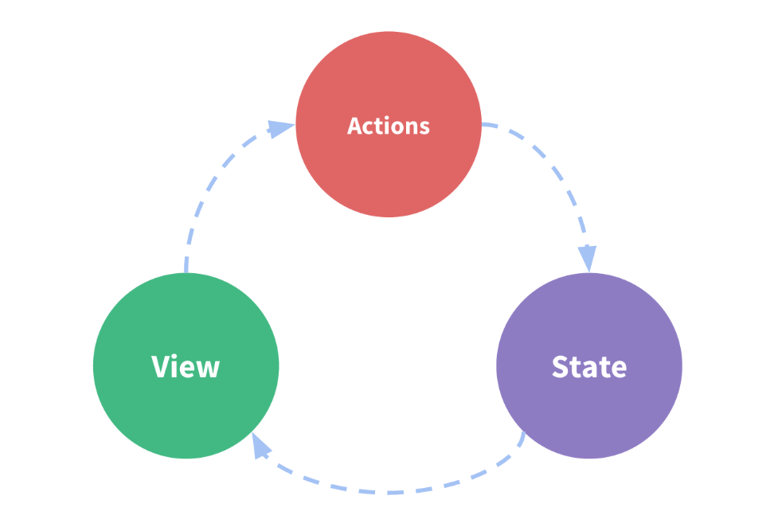

# Redux

## ¿Qué es Redux?

En primer lugar, es útil comprender qué es esto de "Redux". ¿Qué hace? ¿Qué problemas me ayuda a resolver? ¿Por qué querría usarlo?

**Redux es un patrón y una biblioteca para administrar y actualizar el estado de la aplicación, utilizando eventos llamados "acciones"**. Sirve como un almacén centralizado de estados que debe usarse en toda la aplicación, con reglas que garantizan que el estado solo pueda actualizarse de manera predecible.

## ¿Por qué debería utilizar Redux?

Redux le ayuda a gestionar el estado "global", estado necesario en muchas partes de su aplicación.

**Los patrones y herramientas proporcionados por Redux hacen que sea más fácil comprender cuándo, dónde, por qué y cómo se actualiza el estado de su aplicación, y cómo se comportará la lógica de su aplicación cuando se produzcan esos cambios**. Redux lo guía para escribir código que sea predecible y comprobable, lo que le brinda confianza de que su aplicación funcionará como se espera.

## ¿Cuándo debo utilizar Redux?

Redux le ayuda a lidiar con la gestión del estado compartido, pero como cualquier herramienta, tiene sus ventajas y desventajas. Hay más conceptos que aprender y más código que escribir. También agrega cierta dirección indirecta a su código y le pide que siga ciertas restricciones. Es una compensación entre productividad a corto y largo plazo.

Redux es más útil cuando:

* Tiene grandes cantidades de estado de aplicación que se necesitan en muchos lugares de la aplicación.
* El estado de la aplicación se actualiza frecuentemente con el tiempo.
* La lógica para actualizar ese estado puede ser compleja
* La aplicación tiene una base de código de tamaño mediano o grande y muchas personas pueden trabajar en ella.

**No todas las aplicaciones necesitan Redux. Tómate un tiempo para pensar en el tipo de aplicación que estás creando y decide qué herramientas serían mejores para ayudarte a resolver los problemas en los que estás trabajando.**

## Términos y conceptos de Redux

Antes de profundizar en el código real, hablemos de algunos de los términos y conceptos que necesitará saber para usar Redux.

### State Management

omencemos mirando un pequeño componente contador de React. Realiza un seguimiento de un número en el estado del componente e incrementa el número cuando se hace clic en un botón:

```
function Counter() {
  // State: a counter value
  const [counter, setCounter] = useState(0)

  // Action: code that causes an update to the state when something happens
  const increment = () => {
    setCounter(prevCounter => prevCounter + 1)
  }

  // View: the UI definition
  return (
    <div>
      Value: {counter} <button onClick={increment}>Increment</button>
    </div>
  )
}
```

Es una aplicación autónoma con las siguientes partes:

* **The State**: Es la fuente de verdad que impulsa nuestra aplicación;
* **The View**: Es una descripción declarativa de la interfaz de usuario basada en el estado actual.
* **The Actions**: los eventos que ocurren en la aplicación según la entrada del usuario y activan actualizaciones en el estado.

Este es un pequeño ejemplo de **"one-way data flow"**:

* El estado describe el estado de la aplicación en un momento específico
* La interfaz de usuario se representa en función de ese estado.
* Cuando sucede algo (como que un usuario haga clic en un botón), el estado se actualiza en función de lo ocurrido.
* La interfaz de usuario se vuelve a representar según el nuevo estado.





Sin embargo, la simplicidad puede fallar cuando tenemos varios componentes que necesitan compartir y usar el mismo estado, especialmente si esos componentes están ubicados en diferentes partes de la aplicación. A veces, esto se puede resolver "elevando el estado" a los componentes principales, pero eso no siempre ayuda.

Una forma de solucionar esto es extraer el estado compartido de los componentes y colocarlo en una ubicación centralizada fuera del árbol de componentes. Con esto, nuestro árbol de componentes se convierte en una gran "vista", y cualquier componente puede acceder al estado o desencadenar acciones, ¡sin importar dónde se encuentre en el árbol!

Al definir y separar los conceptos involucrados en la gestión estatal y hacer cumplir reglas que mantienen la independencia entre vistas y estados, le damos a nuestro código más estructura y facilidad de mantenimiento.

Esta es la idea básica detrás de Redux: un único lugar centralizado para contener el estado global de su aplicación y patrones específicos a seguir al actualizar ese estado para que el código sea predecible.


### Immutability

"Mutable" significa "cambiable". Si algo es "inmutable", nunca podrá cambiarse.

Los objetos y matrices de JavaScript son todos mutables de forma predeterminada. Si creo un objeto, puedo cambiar el contenido de sus campos. Si creo una matriz, también puedo cambiar el contenido:

```
const obj = { a: 1, b: 2 }
// still the same object outside, but the contents have changed
obj.b = 3

const arr = ['a', 'b']
// In the same way, we can change the contents of this array
arr.push('c')
arr[1] = 'd'
```

A esto se le llama mutar el objeto o matriz. Es el mismo objeto o referencia de matriz en la memoria, pero ahora el contenido dentro del objeto ha cambiado.

**Para actualizar los valores de forma inmutable, su código debe hacer copias de los objetos/matrices existentes y luego modificar las copias.**

Podemos hacer esto manualmente usando los operadores de dispersión de objetos/matriz de JavaScript, así como métodos de matriz que devuelven nuevas copias de la matriz en lugar de mutar la matriz original:

```
const obj = {
  a: {
    // To safely update obj.a.c, we have to copy each piece
    c: 3
  },
  b: 2
}

const obj2 = {
  // copy obj
  ...obj,
  // overwrite a
  a: {
    // copy obj.a
    ...obj.a,
    // overwrite c
    c: 42
  }
}

const arr = ['a', 'b']
// Create a new copy of arr, with "c" appended to the end
const arr2 = arr.concat('c')

// or, we can make a copy of the original array:
const arr3 = arr.slice()
// and mutate the copy:
arr3.push('c')
```


Redux espera que todas las actualizaciones de estado se realicen de forma inmutable. Veremos dónde y cómo esto es importante un poco más adelante, así como algunas formas más sencillas de escribir lógica de actualización inmutable.

## Terminología

Hay algunos términos importantes de Redux con los que deberá estar familiarizado antes de continuar:

### Actions

Una acción es un objeto JavaScript simple que tiene un campo de tipo. **Puedes pensar en una acción como un evento que describe algo que sucedió en la aplicación.**

El campo de tipo debe ser una cadena que le dé a esta acción un nombre descriptivo, como "todos/todoAdded". Generalmente escribimos ese tipo de cadena como "dominio/nombre del evento", donde la primera parte es la característica o categoría a la que pertenece esta acción, y la segunda parte es lo específico que sucedió.

Un objeto de acción puede tener otros campos con información adicional sobre lo sucedido. Por convención, colocamos esa información en un campo llamado carga útil.

Un objeto de acción típico podría verse así:

```
const addTodoAction = {
  type: 'todos/todoAdded',
  payload: 'Buy milk'
}
```

### Action Creators

Un creador de acciones es una función que crea y devuelve un objeto de acción. Normalmente los usamos para no tener que escribir el objeto de acción a mano cada vez:

```
const addTodo = text => {
  return {
    type: 'todos/todoAdded',
    payload: text
  }
}
```

### Reducers

Un reductor es una función que recibe el estado actual y un objeto de acción, decide cómo actualizar el estado si es necesario y devuelve el nuevo estado: (estado, acción) => nuevoEstado. **Puede pensar en un reductor como un detector de eventos que maneja eventos según el tipo de acción (evento) recibida.**

Los reductores siempre deben seguir unas reglas específicas:

* Solo deben calcular el nuevo valor de estado en función de los argumentos de estado y acción.
* No se les permite modificar el estado existente. En cambio, deben realizar actualizaciones inmutables, copiando el estado existente y realizando cambios en los valores copiados.
* No deben realizar ninguna lógica asincrónica, calcular valores aleatorios ni causar otros "efectos secundarios".

Hablaremos más sobre las reglas de los reductores más adelante, incluido por qué son importantes y cómo seguirlas correctamente.

La lógica dentro de las funciones reductoras suele seguir la misma serie de pasos:

* Verifique si al reductor le importa esta acción.
    * Si es así, haga una copia del estado, actualice la copia con nuevos valores y devuélvala
* De lo contrario, devolver el estado existente sin cambios.

A continuación se muestra un pequeño ejemplo de un reductor, que muestra los pasos que debe seguir cada reductor:

```
const initialState = { value: 0 }

function counterReducer(state = initialState, action) {
  // Check to see if the reducer cares about this action
  if (action.type === 'counter/increment') {
    // If so, make a copy of `state`
    return {
      ...state,
      // and update the copy with the new value
      value: state.value + 1
    }
  }
  // otherwise return the existing state unchanged
  return state
}
```

Los reductores pueden usar cualquier tipo de lógica interna para decidir cuál debería ser el nuevo estado: if/else, switch, loops, etc.


### Store


El estado actual de la aplicación Redux reside en un objeto llamado **tienda.**

La tienda se crea pasando un reductor y tiene un método llamado getState que devuelve el valor del estado actual:

```
import { configureStore } from '@reduxjs/toolkit'

const store = configureStore({ reducer: counterReducer })

console.log(store.getState())
// {value: 0}
```


### Dispatch

La tienda Redux tiene un método llamado despacho. **La única forma de actualizar el estado es llamar a store.dispatch() y pasar un objeto de acción.** La tienda ejecutará su función reductora y guardará el nuevo valor de estado dentro, y podemos llamar a getState() para recuperar el valor actualizado:

```
store.dispatch({ type: 'counter/increment' })

console.log(store.getState())
// {value: 1}
```

Puede pensar en enviar acciones como "desencadenar un evento" en la aplicación. Algo pasó y queremos que la tienda lo sepa. Los reductores actúan como oyentes de eventos y, cuando escuchan una acción que les interesa, actualizan el estado en respuesta.

Normalmente llamamos a los creadores de acciones para que realicen la acción correcta:

```
const increment = () => {
  return {
    type: 'counter/increment'
  }
}

store.dispatch(increment())

console.log(store.getState())
// {value: 2}
```


### Selectors

Los selectores son funciones que saben cómo extraer información específica de un valor de estado de tienda. A medida que una aplicación crece, esto puede ayudar a evitar la repetición de la lógica, ya que diferentes partes de la aplicación necesitan leer los mismos datos:

```
const selectCounterValue = state => state.value

const currentValue = selectCounterValue(store.getState())
console.log(currentValue)
// 2
```

## Redux Application Data Flow

Anteriormente hablamos del "flujo de datos unidireccional", que describe esta secuencia de pasos para actualizar la aplicación:

* El estado describe el estado de la aplicación en un momento específico
* La interfaz de usuario se representa en función de ese estado.
* Cuando sucede algo (como que un usuario haga clic en un botón), el estado se actualiza en función de lo ocurrido.
* La interfaz de usuario se vuelve a representar según el nuevo estado.

Para Redux específicamente, podemos desglosar estos pasos con más detalle:

* Configuración inicial:
    * Se crea una tienda Redux usando una función reductora de raíz
    * La tienda llama al reductor raíz una vez y guarda el valor de retorno como su estado inicial.
    * Cuando la interfaz de usuario se representa por primera vez, los componentes de la interfaz de usuario acceden al estado actual de la tienda Redux y utilizan esos datos para decidir qué representar. También se suscriben a futuras actualizaciones de la tienda para poder saber si el estado ha cambiado.
* Actualizaciones:
    * Algo sucede en la aplicación, como que un usuario haga clic en un botón.
    * El código de la aplicación envía una acción a la tienda Redux, como despacho({type: 'counter/increment'})
    * La tienda ejecuta la función reductora nuevamente con el estado anterior y la acción actual, y guarda el valor de retorno como el nuevo estado.
    * La tienda notifica a todas las partes de la interfaz de usuario que están suscritas que la tienda se ha actualizado
    * Cada componente de la interfaz de usuario que necesita datos de la tienda verifica si las partes del estado que necesitan han cambiado.
    * Cada componente que ve que sus datos han cambiado fuerza a volver a renderizar con los nuevos datos, para que pueda actualizar lo que se muestra en la pantalla.

Así es como se ve visualmente ese flujo de datos:


## Un Poco de Historia

### Flux 

En el año 2013, Facebook presentó al mundo Flux, una arquitectura para el manejo de estado en aplicaciones JavaScript. Su objetivo era abordar las limitaciones de las arquitecturas tradicionales como MVC, que a menudo resultaban complejas y difíciles de mantener en aplicaciones web a gran escala.

Flux introdujo tres elementos clave:

* **Dispatcher:** Un punto central para recibir acciones de los componentes.
* **Store:** Un almacén centralizado del estado de la aplicación.
* **View:** Componentes React que renderizan la interfaz de usuario en función del estado actual.

El flujo de datos en Flux era unidireccional: las acciones se enviaban al dispatcher, este las actualizaba en el store, y los componentes se re-renderizaban automáticamente para reflejar el nuevo estado.

Las motivaciones detrás de Flux:

* Simplicidad: Buscaba una arquitectura más simple y clara que MVC, facilitando la comprensión y el mantenimiento de aplicaciones complejas.
* Predictibilidad: El flujo de datos unidireccional hacía que el comportamiento de la aplicación fuera más predecible y fácil de depurar.
* Escalabilidad: Permitía manejar el estado de forma eficiente en aplicaciones con múltiples componentes y usuarios concurrentes.
* Reusabilidad: Facilitaba la creación de componentes reutilizables que no dependían directamente del estado global.

### Redux: La evolución de Flux

En 2014, Dan Abramov, un ingeniero de software de Facebook, introdujo Redux, una biblioteca inspirada en Flux pero con un enfoque más minimalista y robusto. Redux conservaba los principios fundamentales de Flux pero los refinaba y simplificaba:

* **only one store**: En lugar de múltiples stores, Redux centraliza todo el estado de la aplicación en un único almacén.
* **pure Actions:** Las acciones en Redux son simples objetos que describen el evento ocurrido, sin lógica de negocio.
* **pure Reducers:** Los reducers son funciones puras que determinan el nuevo estado en base al estado actual y la acción recibida.
* **Middleware:** Se introduce el concepto de middleware, permitiendo interceptar y modificar las acciones antes de que lleguen al reducer.

### ¿Por qué Redux? Las ventajas sobre Flux:

* Simplicidad extrema: Redux tiene una API más simple y concisa que Flux, facilitando su aprendizaje y uso.
* Herramientas de desarrollo: Redux cuenta con un ecosistema de herramientas de desarrollo robustas que facilitan la depuración y el análisis del estado.
* Comunidad vibrante: Redux tiene una comunidad grande y activa que ofrece apoyo y recursos valiosos.
* Escalabilidad comprobada: Redux ha sido utilizado con éxito en aplicaciones a gran escala de empresas como Netflix, Airbnb y PayPal.


## Recursos de Referencia

* [Redux Essentials, Part 1: Redux Overview and Concepts](https://redux.js.org/tutorials/essentials/part-1-overview-concepts)
* [Redux Essentials, Part 2: Redux Toolkit App Structure](https://redux.js.org/tutorials/essentials/part-2-app-structure)
* [Redux Toolkit Quick Start](https://redux.js.org/tutorials/essentials/part-1-overview-concepts)